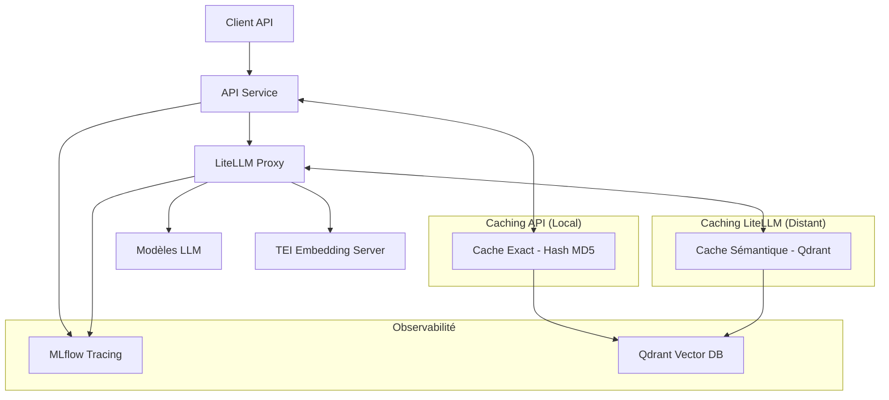

# Architecture de Caching Unifiée

## Résumé

Cette documentation décrit l'architecture de caching unifiée mise en place dans le stack LLMOps, où tous les appels LLM (chat et embeddings) sont routés via le proxy LiteLLM avec une stratégie de caching clairement définie :

- **Cache exact** : Géré par l'API (dans `src/api/cache/exact_cache.py`)
- **Cache sémantique** : Délégué à LiteLLM

## Architecture



## Flux de traitement

1. **Requête client** : Le client envoie une requête à l'API
2. **Cache exact** : L'API vérifie d'abord le cache exact (hash MD5 du prompt)
3. **Appel LiteLLM** : Si pas de cache exact, l'API appelle LiteLLM
4. **Cache sémantique** : LiteLLM vérifie son propre cache sémantique
5. **Appel LLM** : Si pas de cache, LiteLLM appelle le modèle LLM
6. **Stockage** : La réponse est stockée dans le cache exact de l'API

## Configuration

### LiteLLM

Le cache sémantique dans LiteLLM est activé avec les paramètres suivants :

```yaml
litellm_settings:
  cache: true
  cache_params:
    type: "qdrant-semantic"
    qdrant_api_base: "http://qdrant:6333"
    qdrant_collection_name: "litellm_semantic_cache"
    similarity_threshold: 0.7
    qdrant_semantic_cache_embedding_model: local-embed-model
    ttl: 1800
```

### API

L'API ne gère que le cache exact avec l'implémentation dédiée :

```python
cache = ExactCache(
    qdrant_url=settings.QDRANT_URL,
    ttl_seconds=1800,
)
```

## Avantages de cette architecture

1. **Séparation des responsabilités** :
   - Cache exact rapide et déterministe dans l'API
   - Cache sémantique intelligent dans LiteLLM

2. **Centralisation du routing** :
   - Tous les appels LLM passent par LiteLLM
   - Gouvernance centralisée
   - Logging et tracing unifiés

3. **Maintenabilité** :
   - Moins de code personnalisé à maintenir
   - Utilisation des fonctionnalités natives de LiteLLM

## Tests

Pour tester cette architecture :

```bash
# Test du cache exact
make test-exact-cache

# Test du cache sémantique
make test-semantic-cache
```
